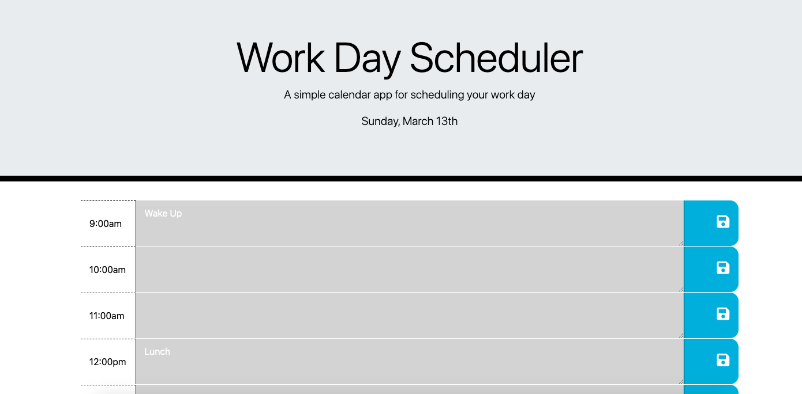

# Workday Scheduler

## My Task

Create a simple calendar application that allows a user to save events for each hour of the day by modifying starter code. This app will run in the browser and feature dynamically updated HTML and CSS powered by jQuery.

# JavaScript Library Usage

* Moment JS

# CSS Frameworks

* Bootstrap

## Mock-Up
 
Below is an example of the interface:

## Languages
 
* HTML
* CSS
* JavaScript
* JQuery

## Website & Repository

* Github: https://github.com/anthonypacella/WorkdayScheduler
* Deployed Website: https://anthonypacella.github.io/WorkdayScheduler/